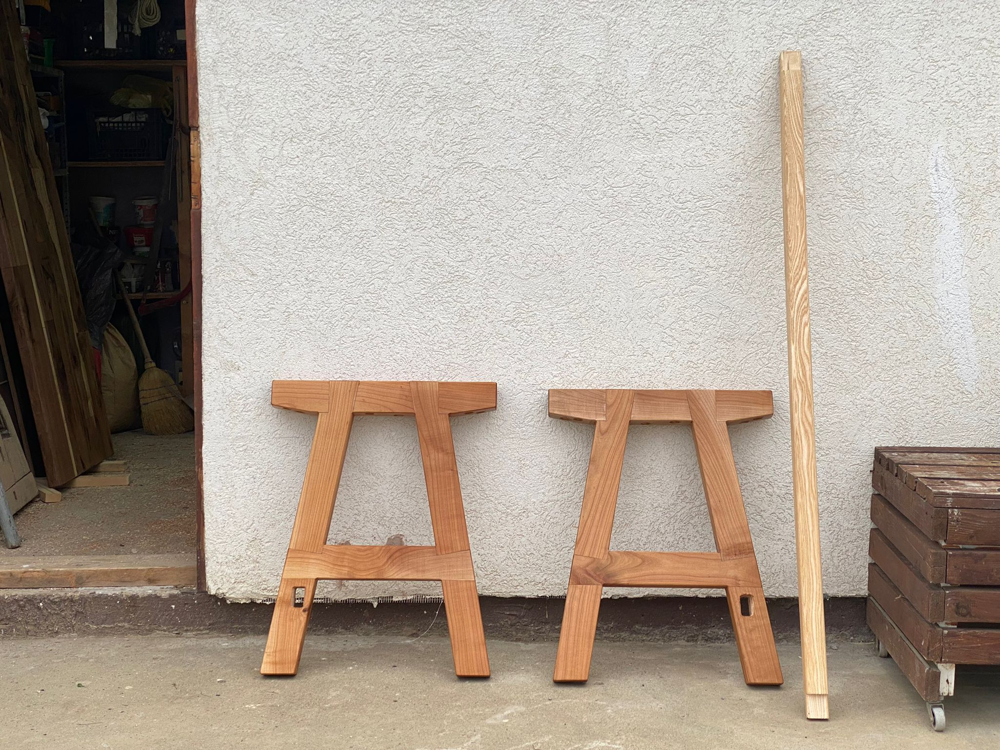
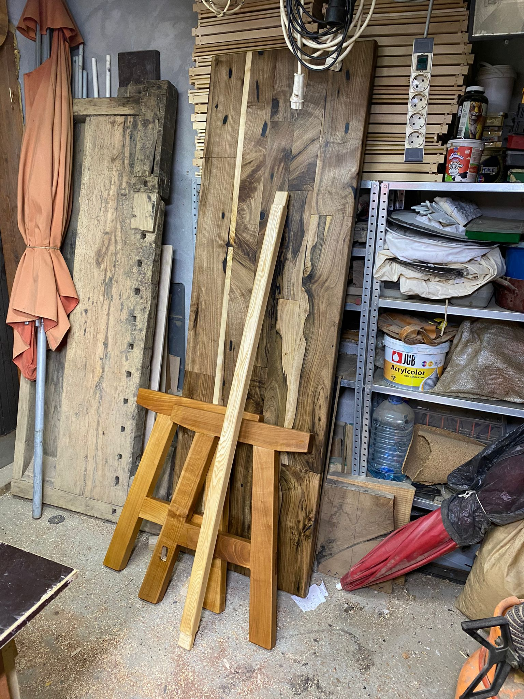
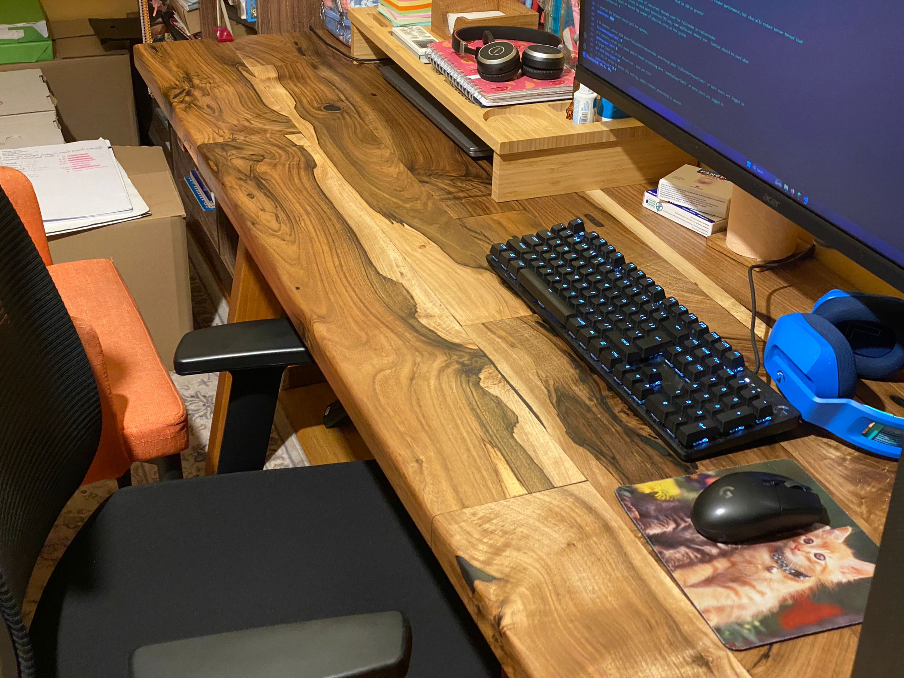
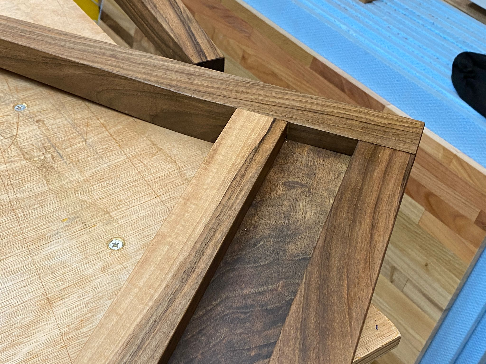
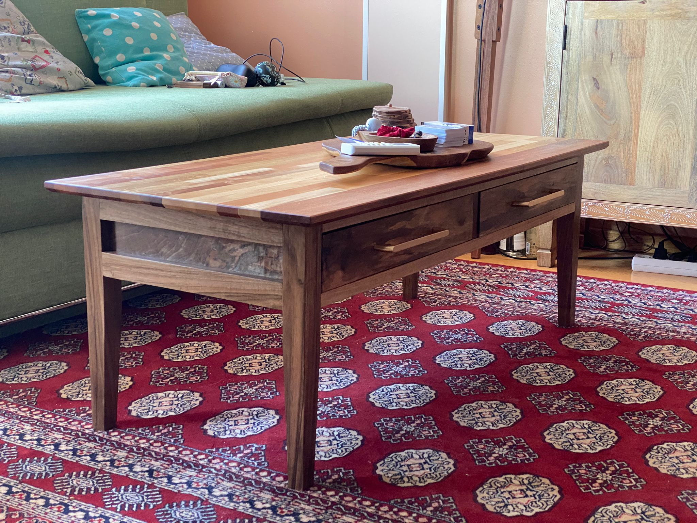
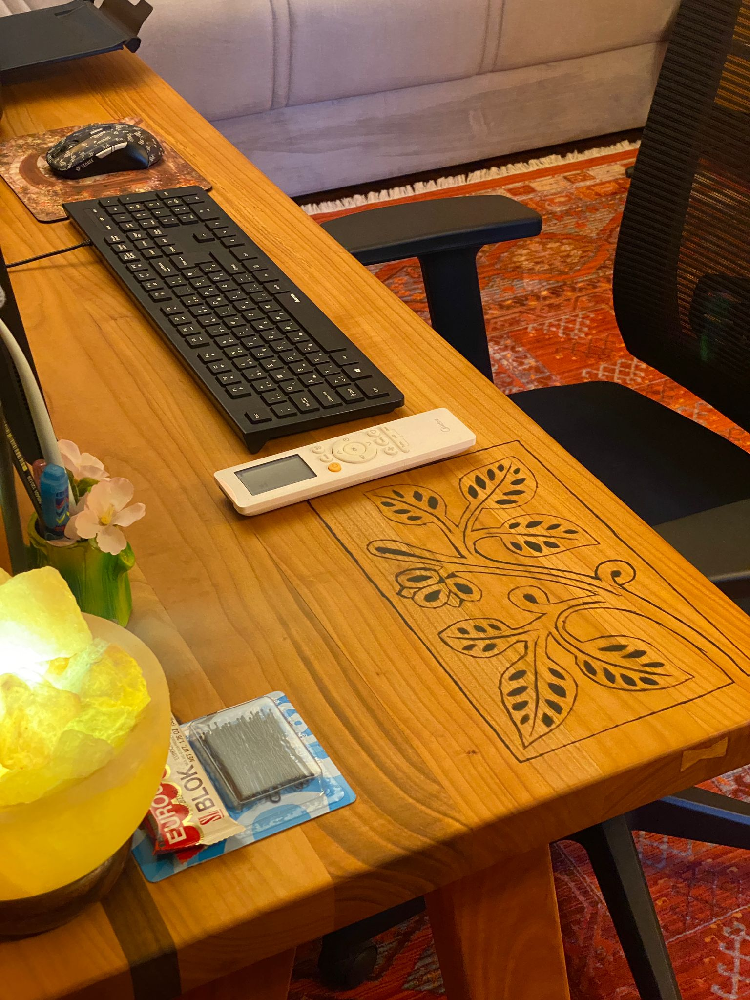
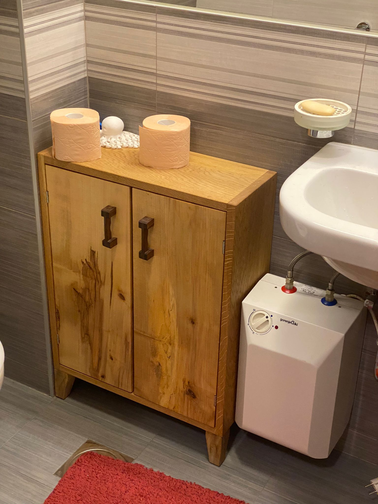
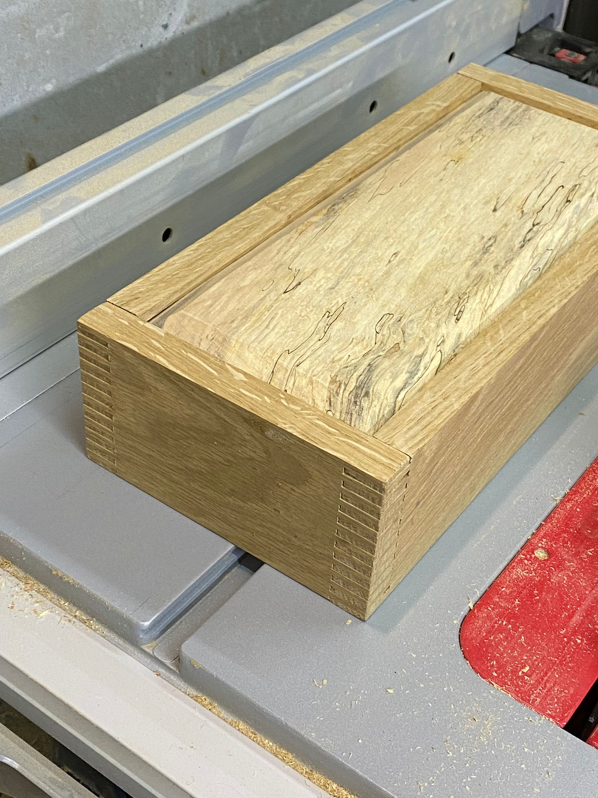
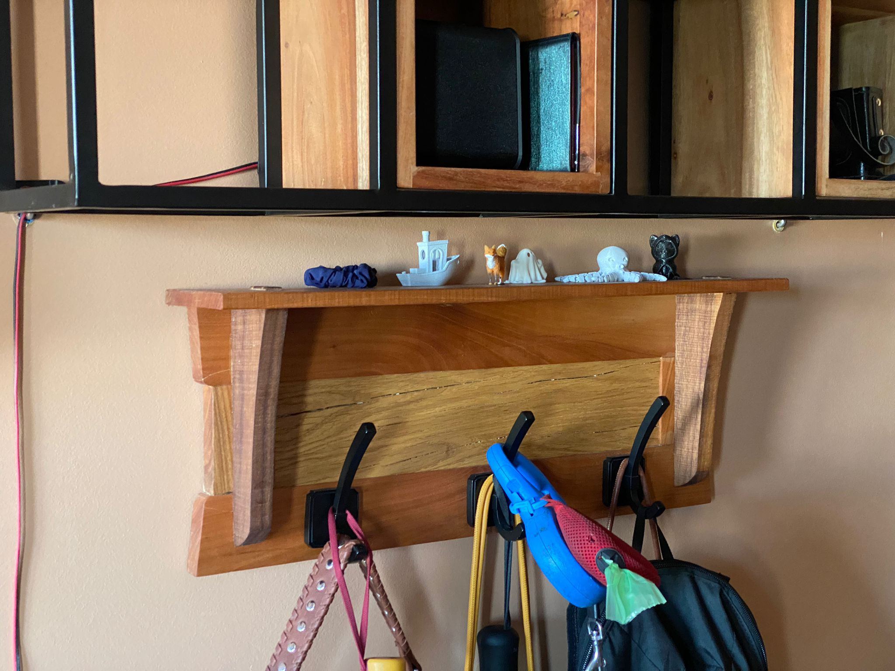

<h1 align="center">Hi, I'm Aleksa Heler</h1>

Computer science and electrical engineering student from Serbia,  working as <b>embedded engineer</b> at Continental Automotive,  with a bunch of personal projects

You can reach out to me here ↓

<h3 align="center">Things I do:</h3>

 
   
   
   
  
   
   
   
   
   
   

<!-- Some macros for statistics -->

&nbsp;

---

<h3 align="center">Some of my projects:</h3>

<h4 align="center">Embedded, SW, HW...</h4>

<!-- OpenHand -->

  
  

  
  

<!-- Marshall Guv'nor -->

  
  
  

<!-- FlexNode -->

  

<!-- DC Load -->

  
  
  

<!-- Wolfenstein port to emulator -->

  

<h4 align="center">Woodworking</h4>

<!-- Woodworking -->

  
  
  

  
  

  
  

  
  
  

<h4 align="center">Game dev</h4>

<!-- Unity games -->

  
  
  

  
  
  

